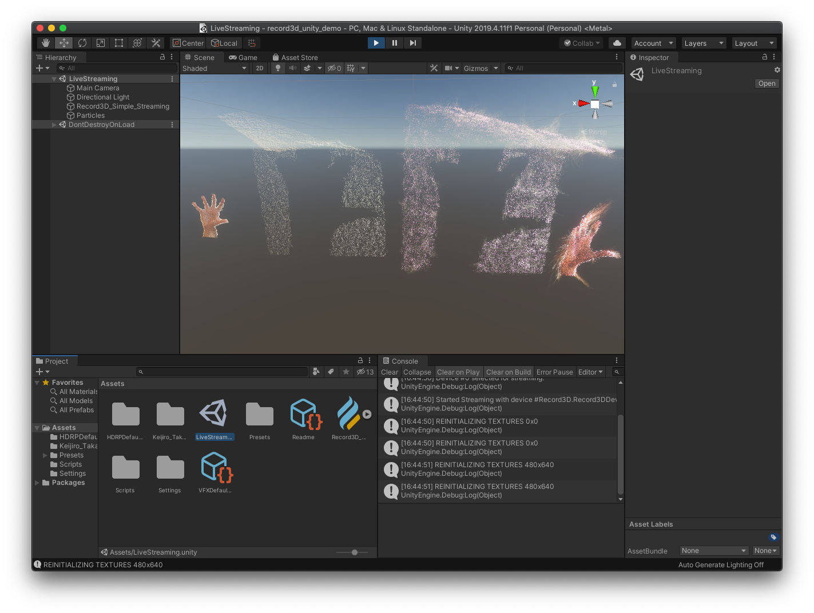

# Unity VFX Graph real-time point cloud streaming via Record3D demo 

**2020/09/26 Update**: Optimized the project for Unity 2019.4.11f1

**2020/09/17 Update**: Introduced LiDAR support

This demo shows how to use the [Record3D app](https://record3d.app/) to stream Point Clouds from your iPhone/iPad with the TrueDepth camera into Unity VFX Graph in real-time.

*Disclaimer: the demo is in pre-alpha state; in case of wider interest I can continue developing this project into a Unity Plugin.*

### Acknowledgements

This project contains a modified [Particles VFX](https://github.com/keijiro/Rsvfx/blob/master/Assets/Test/Vfx/Particles.vfx) of [Keijiro Takahashi](https://github.com/keijiro) which demonstrates how to integrate Record3D live streaming into an existing VFX Graph.

### What will you need?
- An iPhone or iPad with the TrueDepth Camera (FaceID)
- [Record3D iOS app](https://record3d.app) (**live streaming requires purchase**)
- Unity 2019.4.11 or newer
- Make sure you have installed iTunes (on Linux, you will need to install `libusbmuxd-dev` package — should be installed on Ubuntu by default, no action needed)

### Before opening the Unity project
This demo depends on the C++ library [`record3d_unity_streaming`](https://github.com/marek-simonik/record3d_unity_streaming) which you will either need to build yourself or download pre-built (available only for Windows and macOS, you will need to build it yourslef if you are running on Linux).

##### Pre-built library for Windows
Only one `dll` file is needed: [`record3d_unity_streaming.dll`](https://github.com/marek-simonik/record3d_unity_streaming/releases/download/v1.2.0/record3d_unity_streaming.dll). Make sure it is in `PATH` — the easiest way is to copy the file into `C:\Windows\System32` and/or into `C:\Windows\SysWOW64`.

##### Pre-built library for macOS
Similar to Windows, only one `dylib` file is needed: [`librecord3d_unity_streaming.dylib`](https://github.com/marek-simonik/record3d_unity_streaming/releases/download/v1.2.0/librecord3d_unity_streaming.dylib). Just copy it into `/usr/local/lib/`. Alternatively, you can `export` it into `DYLD_LIBRARY_PATH`. 

### After opening the Unity project

1. Open the LiveStreaming scene (`Assets/LiveStreaming.unity`).

1. Connect your iPhone or iPad to your computer via USB cable. To make things easier, try having connected only single iOS device (if multiple iOS devices are connected, you can change the index of USB device in the "Device Index" property of the "Record 3D Stream" Script).

1. Open Record3D, go to the Settings tab and enable "USB Streaming Mode" (purchase required).

1. Go to the Record tab and press the circular red toggle button (you should see "Started, Waiting for Connection" message on your iPhone/iPad).

1. Press the "Play" button in Unity and wait.

1. Live stream should appear — you can now switch into the Scene tab to inspect the live stream.

You can contact me at support@record3d.app if you have any questions or encounter problems.

